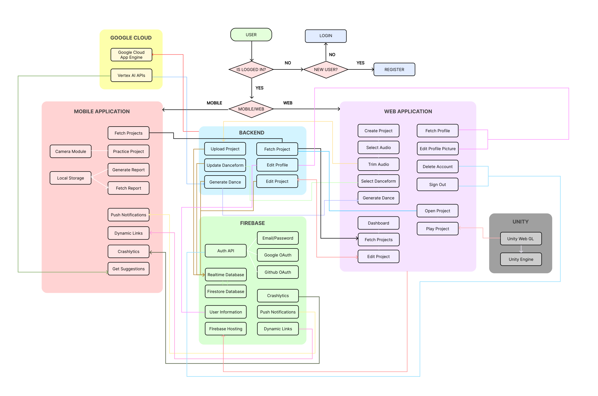
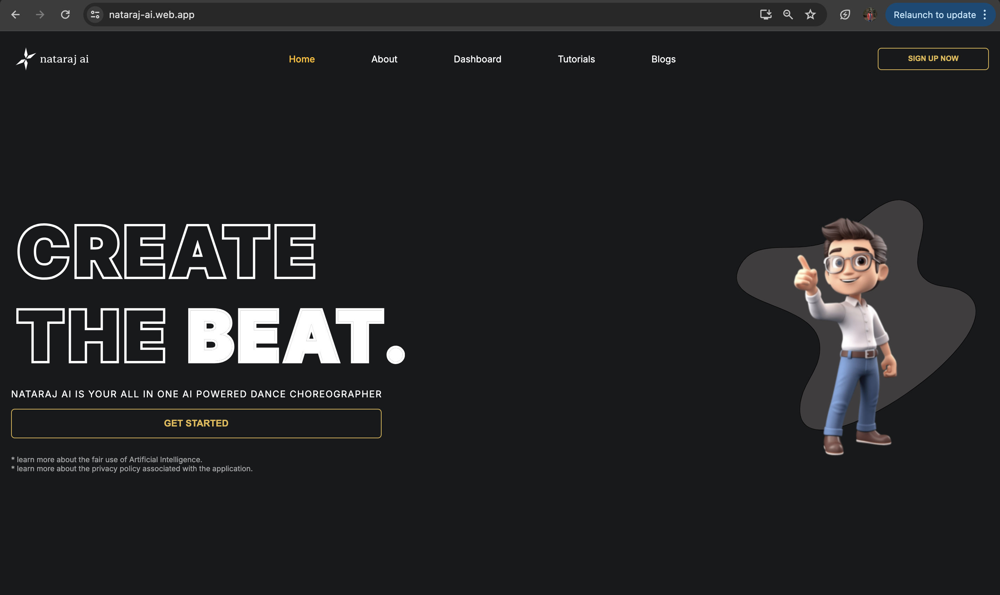
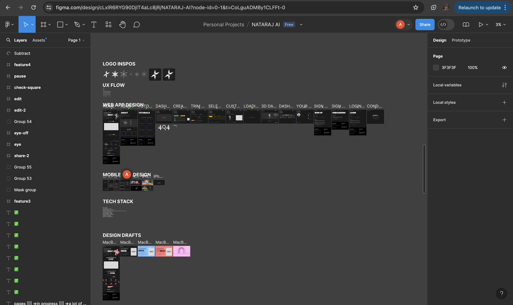
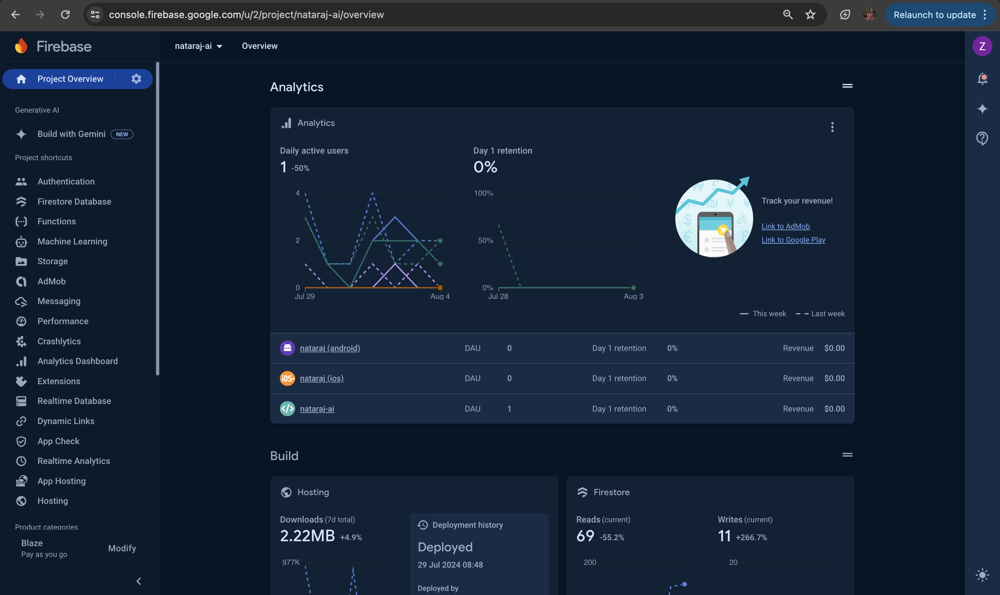
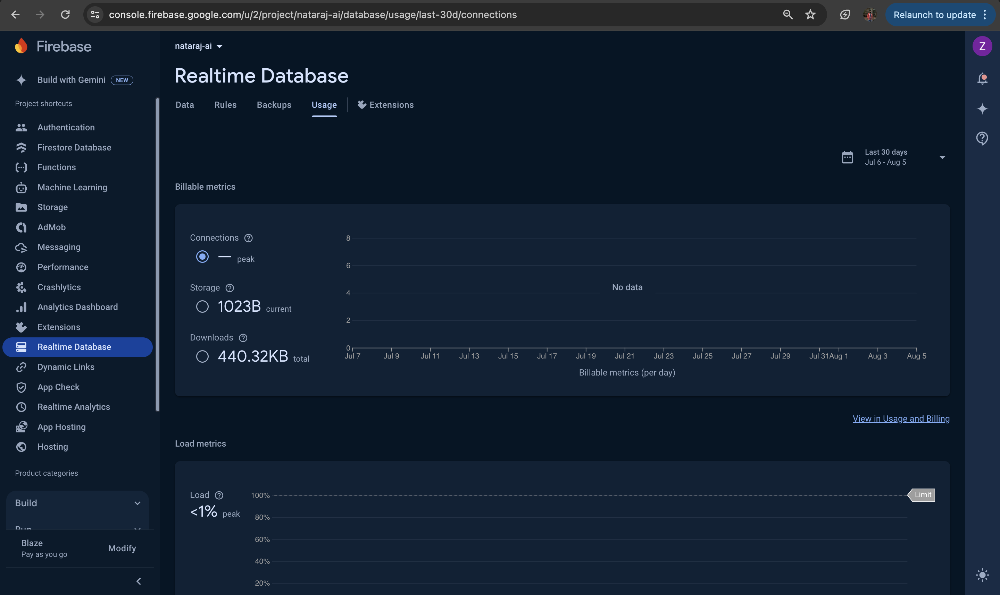
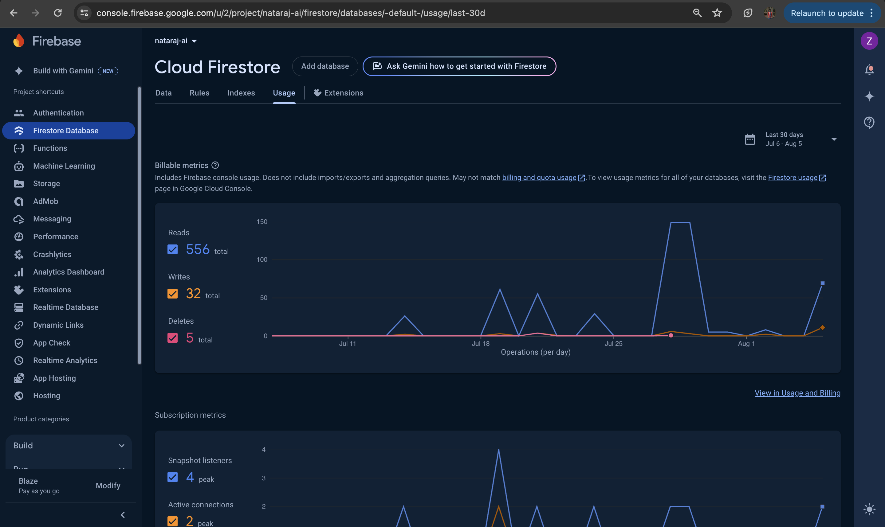

## Nataraj AI
Nataraj is an Artificial Intelligence powered dance choreographer, in 3D!
Live at https://nataraj-ai.web.app

## App description
As a dancer or enthusiast, have you ever found yourself out of ideas for new choreography? Say no more! With AI, the possibilities of creativity are endless. We proudly present Nataraj AI, a platform to revolutionize dance creativity.

Named after the god of dance, Nataraj allows users to upload or import music, trim the desired section, and choose their preferred dance form from the given options. The user's request is then sent to the backend, where the song is converted into timestamp based lyrics. This data, along with the chosen dance form, is fed to Gemini-AI to generate timestamped choreography steps. The prompt is fine tuned to get the relevant encoding that we further use for rendering the choreography. These steps are then translated to our 3D model.

Users can view their model dancing from any 3D perspective, solving the common problem of learning dance from different angles. The created project can be made public or unlisted with a shareable link.

On the mobile app, users can practice their dance and receive detailed reports on their performance. Simply click "practice now" for any project, select the perspective, and mount the phone on a stable surface, ensuring full visibility. After dancing, users can view a report showing how well they matched the choreography. Reports are saved locally on the device.

So, this is a gist of what Nataraj is able to do. There are many more small features to check for, and the use of Gemini and  Google products like Firebase, ARCore, Flutter and Google cloud have made the process more efficient!

## Work Stack
Flutter, Web/Chrome, ARCore, Firebase, Google Cloud, Unity, React, Figma

## App Architecture

## Figma Design
https://www.figma.com/design/cLxlR6RYG90DjlT4aLc8jR/NATARAJ-AI?node-id=0-1&t=CoLguADMBy1CLFFt-0

## Privacy and Copyright Considerations
We store basic user details like name, email and profile picture on our database. Apart from that, the app data is also stored securely on our databases. We don't store any kind of personal media content of user. If it is stored, it is kept in the local storage of user and not sent accross the network.

For copyright considerations, we've made sure we follow the branding guidelines of all the services we've used. The audio that are used in the project are taken from NCS (No Copyright Sounds) and are free to use. Proper attributes have been mentioned as per their guidelines.

## Testing instructions
We've put instructions for both types of testing - deployed version and on local machine. We would recommend testing the deployed version as everything is already set-up there.

1. TESTING THE DEPLOYED VERSION
- Open Nataraj AI's web url (https://nataraj-ai.web.app)
- Download the Android App from play store (https://play.google.com/store/apps/details?id=co.zanie.nataraj)
- Login to both the platforms (Test Credentials: {"Email": "testing@nataraj.com", "Password": "testing@123"})
- Create a new project or view existing projects from (https://nataraj-ai.web.app/dashboard)
- Complete the project creation flow and see Gemini AI generating dance steps for the music that you've selected.
- Once the chorepgraphy is generated, you can play any project from (https://nataraj-ai.web.app/dashboard) in 3D space and with instructions generated from the Gemini API.
- For practicing the dance, one may use the mobile application.
- Open the mobile application, go to Home. Here you'll see all your projects listed with a "Practice It" button.
- Click on the button and select the configurations according to the needs.
- Mount the phone at some stable place so that you're completely visible, and then match the dance steps with the superimposed model.
- Once it is completed, a report would be generated where you can see the match rate and other KPIs (Key Performance Indicators).
- This computation of report using your video happens locally and your video would also remain just on your device, for privacy reasons.
- You can share your projects with others by making it public/unlisted and having a shareable URL.

2. TESTING ON LOCAL MACHINE
- Create a new Firebase project from the web url (https://console.firebase.google.com/)
- Enable the following services - Authentication (Google, Email/Password, GitHub), Firestore Database, Realtime Database, Messaging, Storage, Crashlytics, Dynamic Links.
- Clone the repository to your local device (git clone https://github.com/shrutixyz/nataraj-ai)
- Get the firebase admin key from Service accounts section. Change directory to backend_flask and paste the json key file in the root, and rename it as nataraj-admin-key.json.
- Get all requirements (pip install -r requirements.txt) and run the flask server (flask run),
- Change Directory to web_react and get the dependencies (npm i).
- Change the backend URL to your flask localhost http://localhost:5000/, and start the application (npm start).
- Change directory to app_flutter. Connect the flutter android app to your firebase project (https://firebase.google.com/docsflutter/setup).
- Get dependencies (dart pub get) and then run the mobile application (flutter run).
- Once all this setup is done, you can easily test out the project by following similar same steps as for the deployed version!

## Sub Directories
### 1. web_react
Contains all the code for the frontend and firebase serverless functions in React.js, with typescript being the primary language. Also contains the code for fetching unity components into web.

[Checkout the documentation](./web_react/README.md)

### 2. backend_flask
Contains all the code for the backend and gemini api methods in python.

[Checkout the documentation](./backend_flask/README.md)

### 3. app_flutter
Contains all the code for the mobile application part of the project, which also makes use of firebase and gemini.

[Checkout the documentation](./app_flutter/README.md)

## Relevant Screenshots

