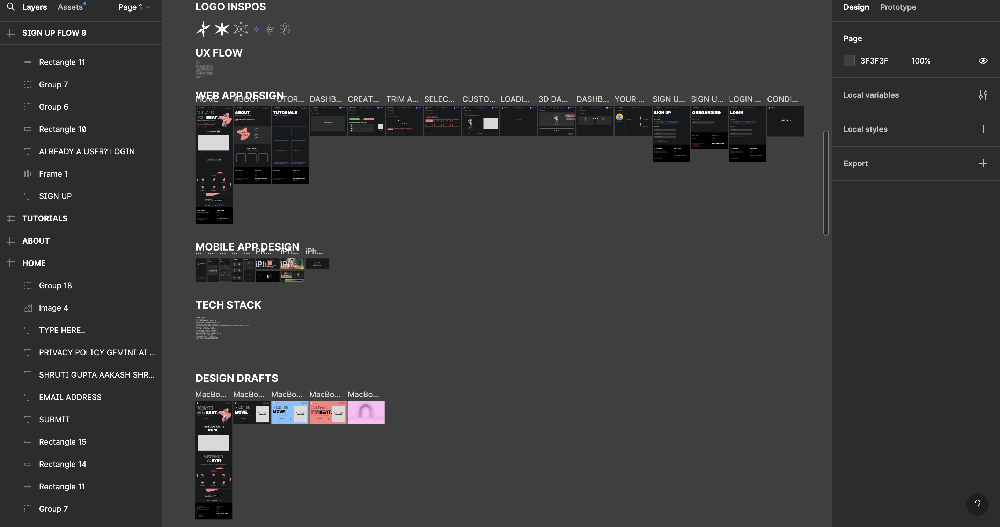

# Developer Journey? What's this

#### Author: Aakash Shrivastava July 6th, 2024 400 words

 

---

So one randfom day, while I was struggling with the architectural setup of Nataraj AI, well not exactly struggling but was feeling a little burnt out for sure, I thought we've got a nice timeline ahead of us, so why don't we include some little fun things to make this development process more enjoyable. Discussed this with Shruti, she agreed in the first go. The next task was to decide on where would we render this, what would we include in these tit-bits, and a little more of architectural planning that would go into it.

  
The conclusion was to have it written in a pretty plain and simple Markdown format, making it easy to lay the design and even easier to render it to the client app via our backend APIs.
  

So currently, I'd say we've got a lot of things figured out with respect to the development of Nataraj. We definitely started with brainstorming the idea, it infact took us a lot of time, more than one would in a hackathon setup. We are pretty ambitious for this hackathon, so we wanted to work on an idea which could hold a lot of value in the real world, and which would break the imagination realm of people and their negative biases with AI. 

  
We don't see a lot of AI in dance, although we see a lot in workouts and exercises. The fact that both have certain similarities, we thought isn't there something we could do in this field. The idea of Nataraj AI grew on us, and we decided to pursue this as our Gemini AI Competition project. Nataraj is the god of dance in hindu mythology, and we aim to let people learn to dance through it, and the best part? They can even practice it and get a proper analysis for themselves. Gemini APis are amazing, loaded with features, and honestly, I've had a look on them since past many months, I've seen how the responses on bard have also improved over time, so yea, makes it a perfect choice for our app. Currently, we're done with the design part, designed the app screens for web and mobile using Figma, sweet tool! We are still to finalise the accent color that we'd want in our app. Amberish-yellow looks cool, but yea yet to finalise. The setup of starter project is also done on github.
  

  
I believe over this week, we'd have firebase setup and connected with our apps on both web and mobile, and moreover we'd have some code development as well. These were the updates for today, would come with some new exciting updates soon!

---