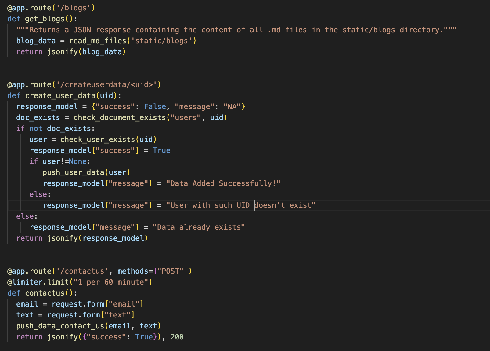

# This week's update

#### Author: Aakash Shrivastava July 20th, 2024 350 words
 

---

Hi there, so we're getting close to the deadline day by day. As much exciting as it sounds, it's kind of like a ticking clock, which is a great motivator for I believe all the developers to complete their projects. I feel that few people (me included sometimes) work better when they'v e tight deadlines. But its a very person specific scenario. We've still got like 20ish days I believe for the hackathon to get over.

  

To say the least, I think that we're on track, a little bit lagging if being honest. We are trying to stretch on weekends and get more things done than usual. We're completely into the coding currently. The two of use are taking turns to work on the three major components of the project - mobile app, web app and the backend with all the Gemini Apis logic. We've created the frontend screens for a lot of design both on react for web and flutter for app. Also integrated few crucial features like authentication on the flutter application, and created API routes and logic for displaying these blogs on the web frontend as well.

  
I've been trying to figure out how we'll be parsing the prompt data to the Gemini API, and how should we structure the workflow. We're currently trying with different types of prompts to see which one would suite us the best. We'll need to fetch the lyrics from the music and sync it, and then we're planning to pass those timeframe-synced lyrics to the api prompt to get respective dance moves. For rendering the dance moves, we're a bit confused on what to choose.

  
Shruti will look more into it this week, and by then we'll be mostly done with all other configurations. So hopefully, in this coming week, we would've started our end to end integration with gemini to generate and render dance moves. We'll be back with more updares soon!

  

