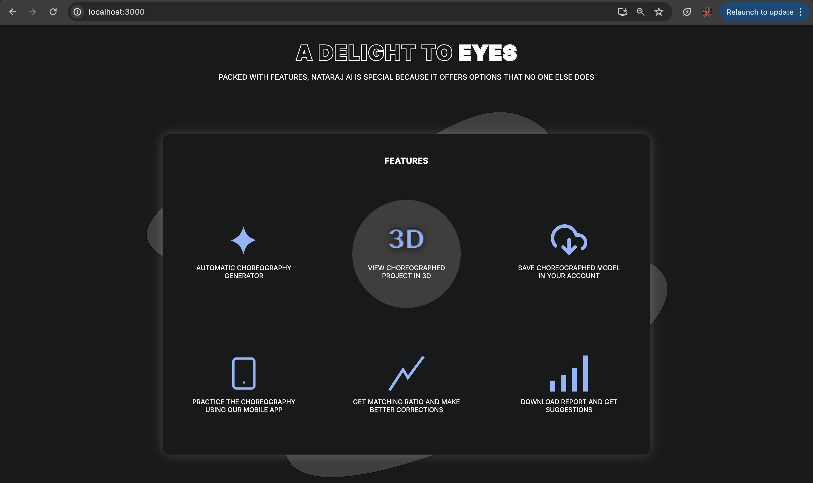
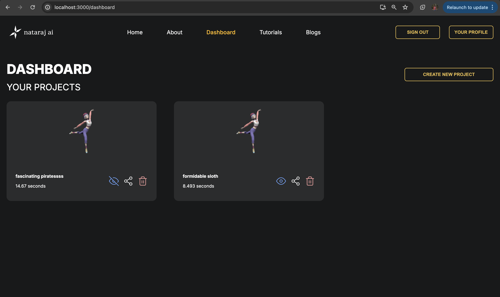

# Nataraj AI - Web React Frontend

This directory contains the React frontend and Firebase serverless code for the Nataraj AI project. Nataraj AI is an innovative application aimed at enhancing dance choreography using AI, incorporating 3D visualization through Unity plugins. The app is live at [nataraj-ai.web.app](https://nataraj-ai.web.app).

## Directory Structure

- `src/pages`: Contains different routes, each within its own subdirectory.
- `src/features`: Contains the various components used in the application.
- `src/assets`: Contains all the assets like images, icons, and stylesheets.
- `src/utils`: This is where you need to add your Firebase configuration file (`firebase-config.js`) to get the project running locally.
- `src/store`: Contains the Redux setup for state management.
- `src/hooks`: Contains custom hooks used throughout the application.

## Prerequisites

Ensure you have the following installed on your machine:
- Node.js (v14.x or later)
- npm (v6.x or later)

## Setup

Follow these steps to set up and run the project locally:

1. **Clone the repository:**
    ```bash
    git clone https://github.com/shrutixyz/nataraj-ai.git
    cd nataraj-ai/web_react
    ```

2. **Install dependencies:**
    ```bash
    npm install
    ```

3. **Add Firebase configuration:**
    Create a file named `firebase-config.js` in the `src/utls` directory and add your Firebase configuration. It should look something like this:
    ```javascript
    const firebaseConfig = {
        apiKey: "your-api-key",
        authDomain: "your-auth-domain",
        projectId: "your-project-id",
        storageBucket: "your-storage-bucket",
        messagingSenderId: "your-messaging-sender-id",
        appId: "your-app-id"
    };

    export default firebaseConfig;
    ```

4. **Run the application:**
    ```bash
    npm start
    ```

    This will start the development server and you can view the application at `http://localhost:3000`.

## 3D Visualization

We use Unity plugins to bring 3D elements into the application. The steps for the model are fetched via the Gemini API and stored in Firebase Realtime Database.

## State Management

The application uses Redux for state management. You can find the Redux setup in the `src/store` directory, where various slices of state are managed.

## Custom Hooks

The `src/hooks` directory contains custom hooks that are utilized throughout the application for various purposes.

## Deployment

The application is deployed on Firebase Hosting. You can find the deployment scripts and configuration in the `firebase.json` file at the root of the repository.

## Screenshots



